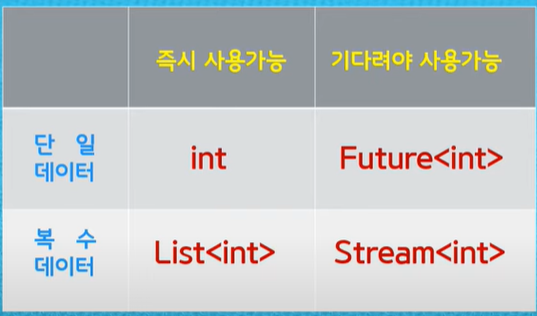

### Data 종류
	

```dart
1. Future
  a. Dart언어는 단일 "thread"로만 실행된다. 즉, 멀티 쓰레드가 안된다.
     스레드를 차단하는 코드는 프로그램을 정시시킬 수 있다.
	b. Future object
     미래에 자료가 채워진다는 의미
     함수가 미완료 상태에서는 Future object를 사용하지 않는다.
     끝났다는 신호가 오면 Future object를 사용한다.
     Future 결과는 sucess, error 2가지 상태가 존재 한다.
  c. 참고
     future는 async코드의 결과를 나타낸다. 처리 또는 입출력은 나중에 완료된다.
     future가 완료 될 때까지 실행을 일시 중단하려면 async함수에서 await을 사용하면 도니다.
     async함수에서 try-catch를 사용해서 에러를 잡는다.
  d. async await
  e. async <-> return Future<> : 일회성 응답에 사용
*/
 

2. Stram


1. 일반 Stream
   1.1 Future는 단일 data하나를 처리 한다면, stream은 data를 여러게(List) 처리 한다.
   1.2 일반 Stream은 한개의 Listener만 가질 수 있다.
   1.3 Stream을 return하는 함수에는 async*를 정의해야 한다.
   1.4 async* : 게으른 연산. 요청이 있을 때는 연산을 미루다가 함수에서 사용시 연산함 
   1.5 yield : return과 비슷하게 값을 반환해주는데 한번에 하나씩 return함과 동시에 
               함수가 종료되지 않고 계속 열려있다면 지속적으로 return해줌
   1.6 async* <-> return Stream<> : 여러번 가져올때 사용
   1.6 전달가능 type : 일반값, 이벤트, 객체, 컬렉션, 맵, 오류,  
                      다른스트림에서 모든 유형의 데이터가 스트림에 의해 전달 가능
   1.7 도착한 Stream은 필요에 따라서 Transform(자료조작)을 할 수 있다.
   1.8 try() catch(e) {} 문을 통해 error를 잡을 수 있다.
   
2. Broadcast Stream
   2.1 Broadcast Stream은 여러개의 Listener를 가질 수 있다.
   2.2 도착한 Stream이 여러게의 Listener에게 전달 된다.
 
참고 URL : https://beomseok95.tistory.com/308
          https://www.youtube.com/watch?v=AKOUDHZsBP0
*/
 
import 'dart:async';
Stream<int> countSream(int to) async* {
  for (int i = 1; i <= to; i++) {
    await Future.delayed(const Duration(seconds: 1));
    yield i;
  }
}
 
Future<int> sumStream(Stream<int> stream) async {
  var sum = 0;
 
  await for (var value in stream) {
    sum += value;
    print(sum);
  }
  return sum;
}
 
main() {
  //baseStream();
  //baseTwoStream(); //error발생
  //baseTransformStream();
  //baseTryExceptionStream();
  broadCastStream();
}
 
/*-------------------------------------------------------------
1. 일반 Stream
   1.1 Future는 단일 data하나를 처리 한다면, stream은 data를 여러게(List) 처리 한다.
   1.2 일반 Stream은 한개의 Listener만 가질 수 있다.
   1.3 Stream을 return하는 함수에는 async*를 정의해야 한다.
   1.4 async* : 게으른 연산. 요청이 있을 때는 연산을 미루다가 함수에서 사용시 연산함 
   1.5 yield : return과 비슷하게 값을 반환해주는데 한번에 하나씩 return함과 동시에 
               함수가 종료되지 않고 계속 열려있다면 지속적으로 return해줌
   1.6 async* <-> return Stream<> : 여러번 가져올때 사용
   1.6 전달가능 type : 일반값, 이벤트, 객체, 컬렉션, 맵, 오류,  
                      다른스트림에서 모든 유형의 데이터가 스트림에 의해 전달 가능
   
  -------------------------------------------------------------   
  최종 결과 : 1   3    6    10    15    21    28    36    45    55
             55
-------------------------------------------------------------- */
void baseStream() async{
  var stream = countSream(10);
  
  //일반 stream에 대한 listner 한개로 정상 수행 됨
  var sum = await sumStream(stream);
  print(sum);  
}
 
/*-------------------------------------------------------------
  1.2 일반 Stream은 한개의 Listener만 가질 수 있다.
      return받은 stream을 두개의 listener에서 받기 때문에 오류 발생
  -------------------------------------------------------------   
  최종 결과 : Uncaught Error: Bad state: Stream has already been listened to.
             1   2   3   4   5   6   7   8  9   10
-------------------------------------------------------------- */
void baseTwoStream() async{
  var stream = countSream(10);
  
  stream.listen((value)=> {
    print(value)
  });
  
  //Uncaught Error: Bad state: Stream has already been listened to.
  //위 script에서 stream에 대한 listener를 사용했기 때문에 아래 listener에서는 오류 발생
  var sum = await sumStream(stream);
  print(sum);  
}
 
/*-------------------------------------------------------------
  1.7 도착한 Stream은 필요에 따라서 Transform(자료조작)을 할 수 있다.
  -------------------------------------------------------------   
  최종 결과 : value: 1      value: 2   .....   value: 10
-------------------------------------------------------------- */
//<int, String> : int 형으로 받아서 string형으로 return
//(value, sink) : value arg변수로 int형 값을 받아서,  자료를 조작 후   sink 변수에 담아 string형으로 return
var transformer = new StreamTransformer<int, String>
                  .fromHandlers(handleData: (value, sink) {sink.add('value: $value');});
 
void baseTransformStream() async{
  var stream = countSream(10);
  
  stream.transform(transformer).listen((value)=> {
    print(value)
  });
}
 
/*-------------------------------------------------------------
  1.8 try() catch(e) {} 문을 통해 error를 잡을 수 있다.
  -------------------------------------------------------------   
  최종 결과 : 1   3   6   10  
             Exception: Intentional Error
             -1
-------------------------------------------------------------- */
void baseTryExceptionStream() async{
  var stream = countSream2(10);
  var sum = await sumStream2(stream);
  print(sum);
}
 
Stream<int> countSream2(int to) async* {
  for (int i = 1; i <= to; i++) {
    await Future.delayed(const Duration(seconds: 1));
    if (i == 5) {
      throw new Exception('Intentional Error');
    } else {
      yield i;
    }
  }
}
 
Future<int> sumStream2(Stream<int> stream) async {
  var sum = 0;
 
  try {
    await for (var value in stream) {
      sum += value;
      print(sum);
    }
  } catch(e) {
    print(e.toString());
    return -1;
  }
  return sum;
}
 
/*-------------------------------------------------------------
2. Broadcast Stream
   2.1 Broadcast Stream은 여러개의 Listener를 가질 수 있다.
   2.2 도착한 Stream이 여러게의 Listener에게 전달 된다.
  -------------------------------------------------------------   
  최종 결과 : again:1    1     again:2   3  ....     again:10    55     55
-------------------------------------------------------------- */
void broadCastStream() async{
  var stream = countSream(10);
  //stream으로 받은 값을 BroascaseStream으로 casting해서 listener 2곳으로 넘겨 준다.
  var bcStream = stream.asBroadcastStream();
  bcStream.listen((value)=> { print("again:$value") });
  
  var sum = await sumStream(bcStream);
  print(sum);
}
```